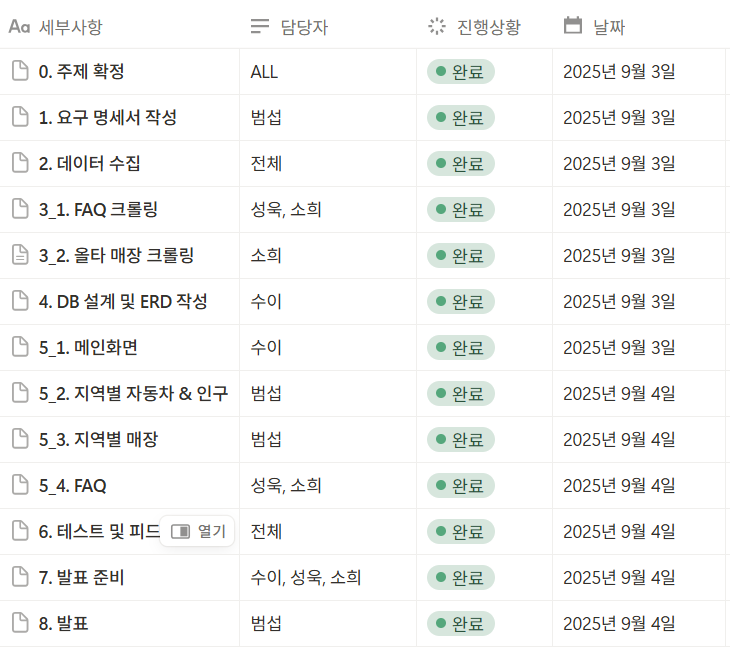
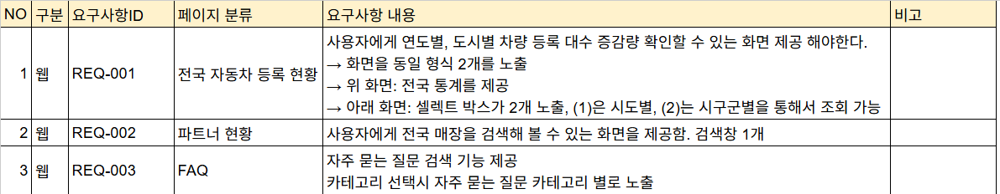
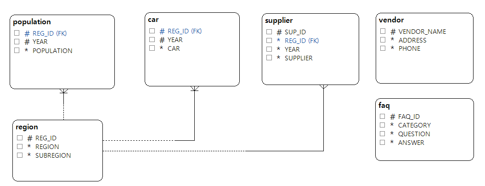

### SK네트웍스 Family AI 캠프 19기 1차 프로젝트

## 팀 소개
### 하지만빨랐조
<table align="center">
 <tr>
    <td align="center" style="padding:20px;">
        <strong>김범섭</strong> 
        <a href="https://github.com/WhatSupYap">GitHub</a> 
         @WhatSupYap
   </td>
    <td align="center" style="padding:20px;">
        <strong>김성욱</strong> 
        <a href="https://github.com/">GitHub</a> 
        @souluk319
    </td>
    <td align="center" style="padding: 20px;">
      <strong>박소희</strong> 
      <a href="https://github.com/souluk319">GitHub</a> 
      @xxoysauce
    </td>
    <td align="center" style="padding: 20px;">
      <strong>안수이</strong> 
      <a href="https://github.com/ahnsui">GitHub</a> 
      @ahnsui
    </td>
  </tr>
</table>

## 프로젝트 소개: 타이어 매장 예비 점주를 위한 정보 제공 플랫폼
전국 자동차 등록 현황 및 기존 타이어 매장 현황 분석을 통한 타이어 매장 개점에 최적화된 입지 정보 제공

## 프로젝트 필요성
1. **자동차 보급률 증가 및 유지보수 수요 확대** 
    
    국내 자동차 등록 대수의 지속적 증가에 따라 개인 차량 보유 일상화
    
    차량 증가 → 정기적인 정비·소모품(특히 타이어) 교체 수요 증가 → 타이어 매장 수요 확대
    
2. **타이어 매장 입지의 중요성**
    
    기존 매장이 과밀한 지역에 신규 매장 개설 시, 경쟁 심화 → 수익성 저하
    
    → 데이터 기반 입지 선정의 필요성
    
3. **경험 부족 보완** 
    
    업계 경험이 부족한 예비 창업자들의 인사이트 제공
    
    → 가시적인 데이터를 활용해 객관적 근거 제공, 의사결정 도구로서의 역할

## 🛠 기술 스택

| 카테고리               | 기술 스택                                                      |
| ---------------------- | ------------------------------------------------------------- |
| **WEB**                |  Streamlit  |
| **라이브러리**         |  Pandas |
| **데이터베이스**       |  MySQL  |
| **개발 환경 및 협업 도구** |  Git,  VSCode,  Notion |

## 📋WBS

## 📋요구 사항 명세서

## 📋ERD

## 🖥️수행 결과

## 데이터셋출처
- **연도별, 지역별 자동차 등록 대수(계)**

    https://stat.molit.go.kr/portal/cate/statView.do?hRsId=58&hFormId=5498 

- **지역별 인구 통계**

    https://kosis.kr/statHtml/statHtml.do?sso=ok&returnurl=https%3A%2F%2Fkosis.kr%3A443%2FstatHtml%2FstatHtml.do%3ForgId%3D101%26tblId%3DDT_1B040A3%26

- **올타 faq, 전국 매장 현황**

    http://alltire.koweb.co.kr/program.html?program_id=koweb_faq

- **금호타이어 FAQ**

    https://www.kumhotire.com/ko/svc/cust/faqList.do

- **가맹점 FAQ**

    https://www.ikfa.or.kr/bbs/faq.php?fm_id=2
  
- **프랭크버거 가맹 FAQ**
    https://frankburger.co.kr/board/index.php?board=faq_01

## 📋한줄 회고 
- **김범섭**

  
- **김성욱**

- **박소희**
  

- **안수이**
